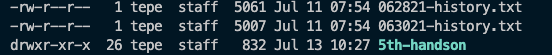

## Linux File Permissions

`read` enables a user to read the contents of the file.

`write` allows a user to modify or delete the file.

`execute` allows a user to run the file as a script or an executable.

`A dash means that the item is a file, whereas a d means it’s a directory. `




To add execution permissions for file's owner group, you can use

```
chmod g+x filename.txt
```
To set execute permissions for everyone.

```
chmod +x filename.txt
```

